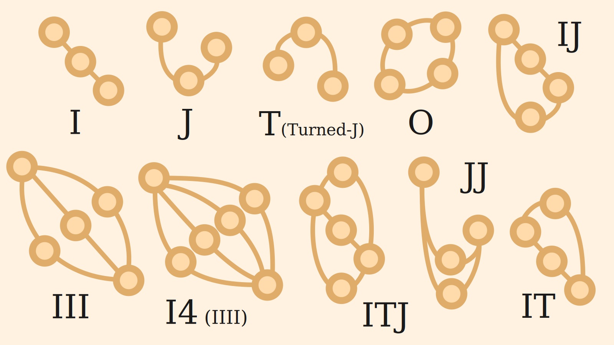

# NumberRailway

⚠️！危険！⚠️
いま数学できなら絶対に読まないでください。
問題が面白すぎて、ほぼ100%
その場で解いてしまいます。

## 概要

駅の名前が自然数で、そこに倍数の路線が通っているという自然数鉄道があったとします。
1の倍数線は、1の駅、2の駅、3の駅……と続いていき、
2の倍数線は、2の駅、4の駅、6の駅……と続いていき、
3の倍数線は、3の駅、6の駅、9の駅……と続いていきます。
例えば、4の駅から10の駅に行きたいとすれば、
1の倍数線に乗って、5の駅、6の駅、7の駅、8の駅、9の駅、10の駅と行くことができます。
このとき、4の駅から10の駅には6つの駅を通過します。
しかし、他にも行き方があり、
さらに言うと行き方によっては、もっと少ない駅数で行くことができます。
4から10への路線図を見せます。

これを見ると、2の倍数線に乗って、6の駅、8の駅、10の駅と行けば、3つの駅で行くことができます。
また、6の駅で3の倍数線に乗り換えて、9の駅で降りて、それから1の倍数線に乗って10の駅に行く方法でも、3つの駅で行くことができます。
さらに、4の倍数線で8の駅で降りて、2の倍数線に乗り換えて10の駅に行けば、2つの駅で行くことができます。
もう一つ、1の倍数線で5の駅で降りて、5の倍数線に乗り換えて10の駅に行く方法でも2つの駅で行くことができます。
このとき、任意の二駅間を最も少ない駅数で行く方法を求めるにはどうしたらいいでしょうか？

### パターン

#### D0型

$\rm{D_0}$ は $d(n, n) = 0$ となるパスです。
最小の例は $R(1, 1) = \lbrace\rbrace$ です。

#### D1型

$\rm{D_1}$ は $d(n, n + 1) = 1$ となるパスです。
最小の例は $R(1, 2) = \lbrace\langle 1, 2 \rangle\rbrace$ です。

#### I型

$\rm{I}$ は $R(m, n) = \lbrace\lbrace\langle m, k \rangle, \langle k, n \rangle\rbrace\rbrace$ で $m < k < n$ となるパスとなるパターンです。  
最小の例は $R(1, 3) = \lbrace\lbrace\langle 1, 2 \rangle, \langle 2, 3 \rangle\rbrace\rbrace$ です。

#### J型

$\rm{J}$ は $R(m, n) = \lbrace\lbrace\langle m, k \rangle, \langle k, n \rangle\rbrace\rbrace$ で $m < n < k$ となるパスとなるパターンです。  
最小の例は $R(6, 11) = \lbrace\lbrace\langle 6, 12 \rangle, \langle 12, 11 \rangle\rbrace\rbrace$ です。

#### Turned-J型

$\rm{T}$ (Turned-J) は $R(m, n) = \lbrace\lbrace\langle m, k \rangle, \langle k, n \rangle\rbrace\rbrace$ で $k < m < n$ となるパスとなるパターンです。  
最小の例は $R(13, 18) = \lbrace\lbrace\langle 13, 12 \rangle, \langle 12, 18 \rangle\rbrace\rbrace$ です。

#### O型

$\rm{O}$ は $R(m, n) = \lbrace\lbrace\langle m, k_1 \rangle, \langle k_1, n \rangle\rbrace, \lbrace\langle m, k_2 \rangle, \langle k_2, n \rangle\rbrace\rbrace$ で $m < k_1 < k_2 < n$ となるパスとなるパターンです。
最小の例は $R(2, 6) = \lbrace\lbrace\langle 2, 3 \rangle, \langle 3, 6 \rangle\rbrace, \lbrace\langle 2, 4 \rangle, \langle 4, 6 \rangle\rbrace\rbrace$ です。

#### IJ型

$\rm{IJ}$ は $R(m, n) = \lbrace\lbrace\langle m, k_1 \rangle, \langle k_1, n \rangle\rbrace, \lbrace\langle m, k_2 \rangle, \langle k_2, n \rangle\rbrace\rbrace$ で $m < k_1 < n < k_2$ となるパスとなるパターンです。
最小の例は $R(3, 5) = \lbrace\lbrace\langle 3, 4 \rangle, \langle 4, 5 \rangle\rbrace, \lbrace\langle 3, 6 \rangle, \langle 6, 5 \rangle\rbrace\rbrace$ です。

#### IT型

$\rm{IT}$ は $R(m, n) = \lbrace\lbrace\langle m, k_1 \rangle, \langle k_1, n \rangle\rbrace, \lbrace\langle m, k_2 \rangle, \langle k_2, n \rangle\rbrace\rbrace$ で $k_1 < m < k_2 < n$ となるパスとなるパターンです。
最小の例は $R(7, 9) = \lbrace\lbrace\langle 7, 8 \rangle, \langle 8, 9 \rangle\rbrace, \lbrace\langle 7, 6 \rangle, \langle 6, 9 \rangle\rbrace\rbrace$ です。

#### IJT型

$\rm{IJT}$ は $R(m, n) = \lbrace\lbrace\langle m, k_1 \rangle, \langle k_1, n \rangle\rbrace, \lbrace\langle m, k_2 \rangle, \langle k_2, n \rangle\rbrace, \lbrace\langle m, k_3 \rangle, \langle k_3, n \rangle\rbrace\rbrace$ で $k_1 < m < k_2 < n < k_3$ となるパスとなるパターンです。
最小の例は $R(5, 8) = \lbrace\lbrace\langle 5, 4 \rangle, \langle 4, 8 \rangle\rbrace, \lbrace\langle 5, 6 \rangle, \langle 6, 8 \rangle\rbrace, \lbrace\langle 5, 10 \rangle, \langle 10, 8 \rangle\rbrace\rbrace$ です。

#### III型

$\rm{III}$ は $R(m, n) = \lbrace\lbrace\langle m, k_1 \rangle, \langle k_1, n \rangle\rbrace, \lbrace\langle m, k_2 \rangle, \langle k_2, n \rangle\rbrace, \lbrace\langle m, k_3 \rangle, \langle k_3, n \rangle\rbrace\rbrace$ で $m < k_1 < k_2 < k_3 < n$ となるパスとなるパターンです。
最小の例は $R(8, 18) = \lbrace\lbrace\langle 8, 9 \rangle, \langle 9, 18 \rangle\rbrace, \lbrace\langle 8, 12 \rangle, \langle 12, 18 \rangle\rbrace, \lbrace\langle 8, 16 \rangle, \langle 16, 18 \rangle\rbrace\rbrace$ です。

.png)

#### I4型

$\rm{I4}$ (IIII)は $R(m, n) = \lbrace\lbrace\langle m, k_1 \rangle, \langle k_1, n \rangle\rbrace, \lbrace\langle m, k_2 \rangle, \langle k_2, n \rangle\rbrace, \lbrace\langle m, k_3 \rangle, \langle k_3, n \rangle\rbrace, \lbrace\langle m, k_4 \rangle, \langle k_4, n \rangle\rbrace\rbrace$ で $m < k_1 < k_2 < k_3 < k_4 < n$ となるパスとなるパターンです。
最小の例は $R(54, 84) = \lbrace\lbrace\langle 54, 56 \rangle, \langle 56, 84 \rangle\rbrace, \lbrace\langle 54, 63 \rangle, \langle 63, 84 \rangle\rbrace, \lbrace\langle 54, 72 \rangle, \langle 72, 84 \rangle\rbrace, \lbrace\langle 54, 81 \rangle, \langle 81, 84 \rangle\rbrace\rbrace$ です。

.png)

#### I5型

$\rm{I5}$ は $R(m, n) = \lbrace\lbrace\langle m, k_1 \rangle, \langle k_1, n \rangle\rbrace, \lbrace\langle m, k_2 \rangle, \langle k_2, n \rangle\rbrace, \lbrace\langle m, k_3 \rangle, \langle k_3, n \rangle\rbrace, \lbrace\langle m, k_4 \rangle, \langle k_4, n \rangle\rbrace, \lbrace\langle m, k_5 \rangle, \langle k_5, n \rangle\rbrace\rbrace$ で $m < k_1 < k_2 < k_3 < k_4 < k_5 < n$ となるパスとなるパターンです。
最小の例は $(312, 378)$ です。パスは以下の通りです。
$$
\begin{aligned}
R(312, 378) = \lbrace& \lbrace\langle 312, 315 \rangle, \langle 315, 378 \rangle\rbrace, \\
                     & \lbrace\langle 312, 324 \rangle, \langle 324, 378 \rangle\rbrace, \\
                     & \lbrace\langle 312, 336 \rangle, \langle 336, 378 \rangle\rbrace, \\
                     & \lbrace\langle 312, 351 \rangle, \langle 351, 378 \rangle\rbrace, \\
                     & \lbrace\langle 312, 364 \rangle, \langle 364, 378 \rangle\rbrace\rbrace
\end{aligned}
$$

.png)

## Installation

Install the gem and add to the application's Gemfile by executing:

    $ bundle add number-railway

If bundler is not being used to manage dependencies, install the gem by executing:

    $ gem install number-railway

## Usage

TODO: Write usage instructions here

## Development

After checking out the repo, run `bin/setup` to install dependencies. Then, run `rake spec` to run the tests. You can also run `bin/console` for an interactive prompt that will allow you to experiment.

To install this gem onto your local machine, run `bundle exec rake install`. To release a new version, update the version number in `version.rb`, and then run `bundle exec rake release`, which will create a git tag for the version, push git commits and the created tag, and push the `.gem` file to [rubygems.org](https://rubygems.org).

## Contributing

Bug reports and pull requests are welcome on GitHub at https://github.com/[USERNAME]/number-railway. This project is intended to be a safe, welcoming space for collaboration, and contributors are expected to adhere to the [code of conduct](https://github.com/[USERNAME]/number-railway/blob/main/CODE_OF_CONDUCT.md).

## License

The gem is available as open source under the terms of the [MIT License](https://opensource.org/licenses/MIT).

## Code of Conduct

Everyone interacting in the NumberRailway project's codebases, issue trackers, chat rooms and mailing lists is expected to follow the [code of conduct](https://github.com/[USERNAME]/number-railway/blob/main/CODE_OF_CONDUCT.md).
